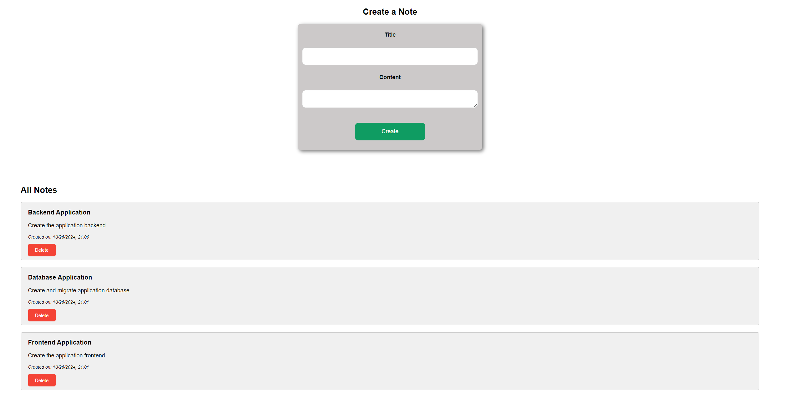

# Django-React Notes App

## Project Overview

This project is a full-stack note-taking application built with a React frontend and a Django backend. It allows users to create, read, update, and delete notes, with user authentication to ensure data privacy.

## Technology Stack

### Frontend
- **React**: A JavaScript library for building user interfaces
- **Axios**: Promise-based HTTP client for making API requests
- **React Router**: For handling routing in the React application

### Backend
- **Django**: A high-level Python web framework
- **Django Rest Framework**: A powerful and flexible toolkit for building Web APIs
- **SQLite**: A lightweight database used for development (can be easily switched to PostgreSQL for production)

## Key Components and Concepts

### Frontend (React)

1. **Components**:
   - `Home`: The main component for displaying and managing notes
   - `Note`: A reusable component for rendering individual notes
   - `Message`: A component for displaying success/error messages
   - `Login` and `Register`: Components for user authentication

2. **State Management**:
   - Using React's `useState` hook for local state management
   - Managing notes, form inputs, and UI messages as state

3. **Side Effects**:
   - Utilizing `useEffect` hook for fetching notes on component mount and managing message timeouts

4. **API Integration**:
   - Using Axios to make HTTP requests to the backend API
   - Handling CRUD operations for notes

5. **Routing**:
   - Implementing client-side routing with React Router

6. **User Authentication**:
   - Storing and managing JWT tokens for authenticated requests
   - Protecting routes that require authentication

### Backend (Django)

1. **Models**:
   - `Note`: Represents the data structure for notes, including fields like title, content, creation date, and author

2. **Views**:
   - Using Django Rest Framework's generic views for handling CRUD operations
   - Implementing custom logic for user-specific note retrieval and creation

3. **Serializers**:
   - Defining how complex data types are converted to native Python datatypes that can then be easily rendered into JSON

4. **Authentication**:
   - Using JWT (JSON Web Tokens) for secure user authentication
   - Implementing custom user model and authentication views

5. **Permissions**:
   - Ensuring that users can only access and modify their own notes

6. **URL Routing**:
   - Defining API endpoints for note operations and user authentication

## Key Features

1. **User Registration and Login**: Secure account creation and authentication system
2. **Create Notes**: Users can create new notes with a title and content
3. **View Notes**: Display all notes created by the logged-in user
4. **Update Notes**: Allow users to edit their existing notes
5. **Delete Notes**: Users can remove notes they no longer need
6. **Responsive Design**: The frontend is designed to work well on various screen sizes

## Data Flow

1. User interacts with the React frontend (e.g., creating a note)
2. Frontend sends an HTTP request to the appropriate Django API endpoint
3. Django processes the request, interacts with the database if necessary
4. Django sends a response back to the frontend
5. React updates the UI based on the response

## Security Considerations

- JWT tokens are used for maintaining user sessions
- CORS (Cross-Origin Resource Sharing) is configured to allow requests only from the frontend domain
- Passwords are securely hashed before storing in the database
- API endpoints are protected to ensure users can only access their own data

## Setup and Installation

Follow these steps to set up and run the project on your local machine:

### Prerequisites
- Python 3.8+

### Project Setup

1. Clone the repository:
   ```
   git clone https://github.com/vju8/Django-React-NotesApp.git
   cd django-react-notes-app
   ```

2. Create a virtual environment and activate it:
   ```
   python -m venv venv
   source venv/bin/activate  # On Windows, use `venv\Scripts\activate`
   ```

3. Install dependencies:
   ```
   pip install -r requirements.txt
   ```

4. Run migrations:
   ```
   python manage.py migrate
   ```

5. Start the Django server:
   ```
   python manage.py runserver
   ```

The application should now be running at `http://localhost:5173/`.

### Accessing the Application

1. Open your web browser and go to `http://localhost:5173/`
2. You should see the login page. If you don't have an account, click on the register link to create one.
3. Once logged in, you can start creating, viewing, editing, and deleting notes.

## Screenshots


*Overview of main notes app*